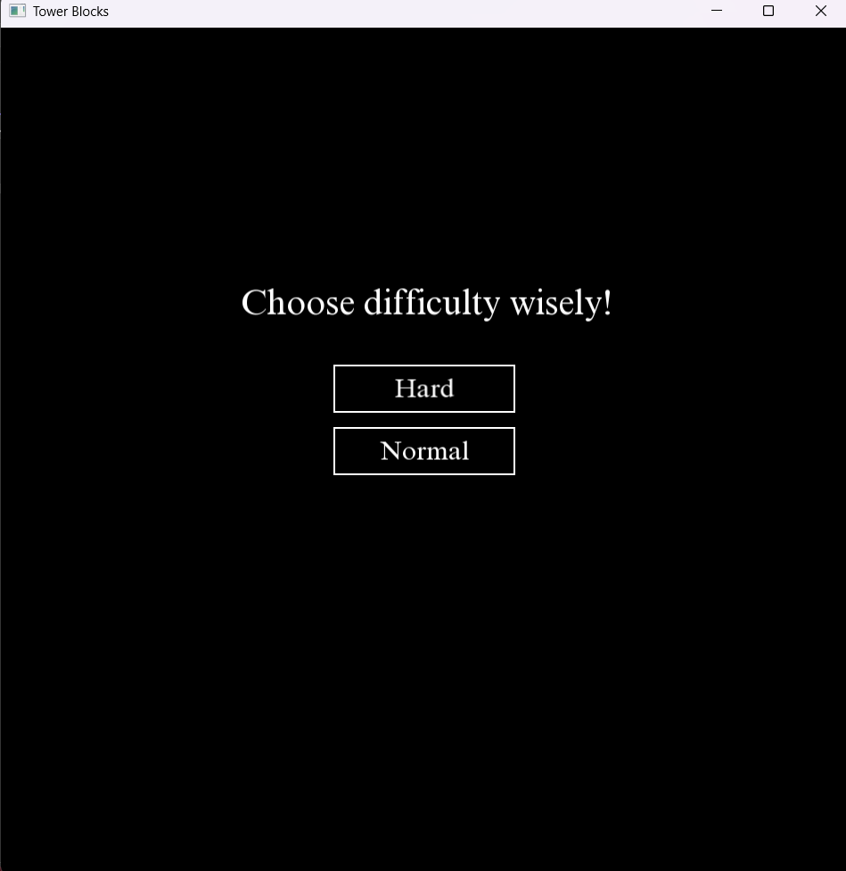
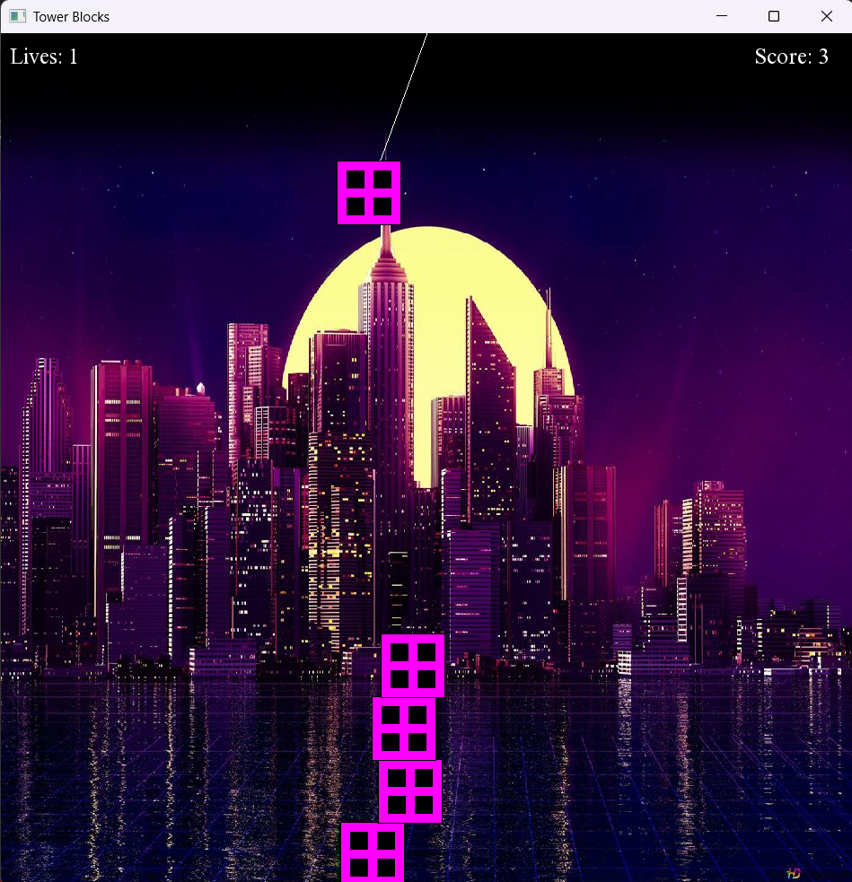

# TowerBlox Game

**TowerBlox** is a simple 2D game developed in C++ inspired by the mobile game **CityBloxx**. The objective of the game is to stack falling blocks with precision and timing to build the tallest tower possible. It challenges the player's reflexes and coordination as they attempt to create a stable tower.

## Features

- **Simple UI:** A minimalistic interface that replicates the gameplay of **CityBloxx**, focused on the block stacking mechanics.
- **Increasing Difficulty:** The game speeds up as you progress, making it more challenging to stack the blocks correctly.
- **Block Stacking:** Blocks fall from the top, and you must align them perfectly to prevent the tower from toppling over.
- **Game Over Conditions:** The game ends if a block is misaligned and falls off the tower.

## Screenshots
  

## How to Play

1. **Stack Blocks:** As the blocks fall from the top of the screen, press the left mouse button.
2. **Build the Tower:** Each correctly placed block becomes part of the tower. The goal is to build the tallest tower without causing it to collapse.
3. **Game Over:** The game ends if the blocks fall off the stack due to misalignment. Try again to beat your high score!

## Installation

To get started with the TowerBlock game, follow these steps:

### Prerequisites
- **SFML (Simple and Fast Multimedia Library)** is required for graphics rendering.

### Steps:
1. Clone or download this repository to your local machine.
   
   git clone https://github.com/ataur-rehman/TowerBlox.git
   
2. Navigate to the project folder.
   cd TowerBlock
   
3. Compile the code using your preferred C++ compiler. Ensure you have SFML properly set up.
   - For example, using g++:
   g++ -o towerblock main.cpp -lsfml-graphics -lsfml-window -lsfml-system

4. Run the compiled game.
   ./towerblock

## Dependencies

- **SFML**: A simple multimedia library used to handle window creation, graphics rendering, and input.
  
  [SFML Installation Guide](https://www.sfml-dev.org/download.php)

### 📧 **Contact & Support**  
💼 **GitHub: https://github.com/ataur-rehman
📩 **Email: ataurrehman3636@gmail.com

### ⭐ If you like this project, consider giving it a **star** on GitHub! ⭐  

